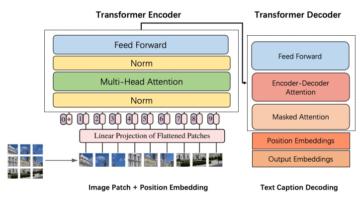
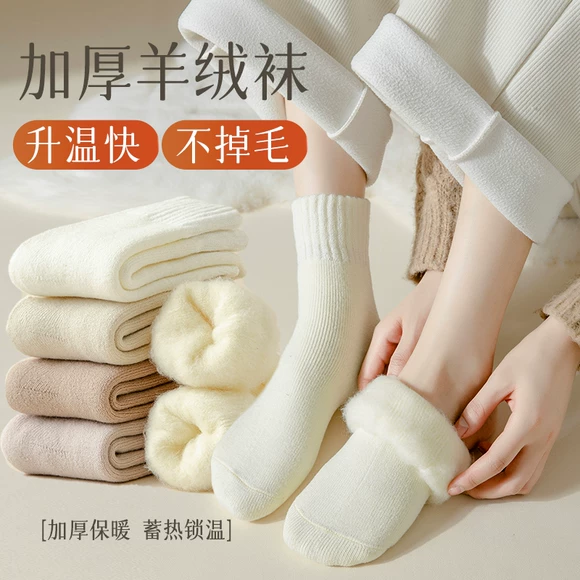
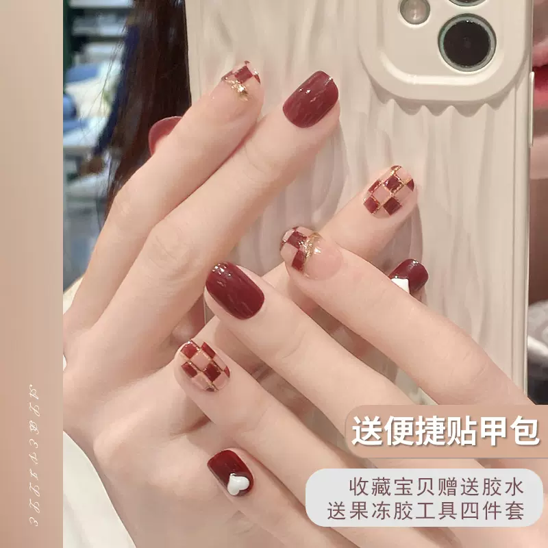

## Chinese-Image-Caption

#### 模型功能与结构

1. 该模型功能主要是对图片生成文字描述。
2. 模型结构使用Encoder-Decoder结构，其中Encoder使用[BEiT](https://arxiv.org/pdf/2106.08254.pdf)（Vision Transformer, BERT-like），Decoder使用GPT。
3. 使用[Muge Image Caption数据集](https://tianchi.aliyun.com/dataset/107332)作为训练语料，训练5k步，最终验证集loss为0.3737，rouge1为20.419，rouge2为7.3553，rougeL为17.3753，rougeLsum为17.376。




#### 如何使用

```python
from transformers import VisionEncoderDecoderModel, ViTFeatureExtractor, AutoTokenizer
from PIL import Image

pretrained = "Maciel/Muge-Image-Caption"
model = VisionEncoderDecoderModel.from_pretrained(pretrained)
feature_extractor = ViTFeatureExtractor.from_pretrained(pretrained)
tokenizer = AutoTokenizer.from_pretrained(pretrained)

image_path = "./images/小耳钉.jpg"
image = Image.open(image_path)
if image.mode != "RGB":
		image = image.convert("RGB")
pixel_values = feature_extractor(images=image, return_tensors="pt").pixel_values

output_ids = model.generate(pixel_values, **gen_kwargs)
preds = tokenizer.batch_decode(output_ids, skip_special_tokens=True)
preds = [pred.strip() for pred in preds]
print(preds)
```

我们在**huggingface**上提供了下载链接和体验接口：

| 模型                                                         | 支持语言 | 备注                                                    |
| ------------------------------------------------------------ | -------- | ------------------------------------------------------- |
| [Muge-Image-Caption](https://huggingface.co/Maciel/Muge-Image-Caption) | 中文     | 使用Muge图文生成数据集，冻结BEiT权重，针对GPT权重微调。 |


### 案例展示

| 图片                                                         | 描述                             |
| ------------------------------------------------------------ | -------------------------------- |
|  | 百搭半身裙，穿出优雅气质         |
|  | 柔软舒适棉袜，给你温暖呵护       |
|  | 尖头细高跟鞋，轻松穿出女神范     |
|  | 秋冬穿对型男潮流外套，时髦又保暖 |
|  | 简约美甲，让你的生活更美好       |
|  | 时尚印花卫衣，演绎青春活力       |
|  | 高颜值洗衣机，让你的生活更加精致 |
|  | 精美耳饰，点缀你的精致生活       |


#### 继续训练

1. 如果想要在自己的语料上继续预训练，则处理好自己的语料后使用finetune脚本。
2. 如果想要从原始的ViT和GPT模型开始预训练，则使用train脚本。


#### 参考文献

1. https://ankur3107.github.io/blogs/the-illustrated-image-captioning-using-transformers/
2. https://huggingface.co/nlpconnect/vit-gpt2-image-captioning
3. https://github.com/yangjianxin1/OFA-Chinese